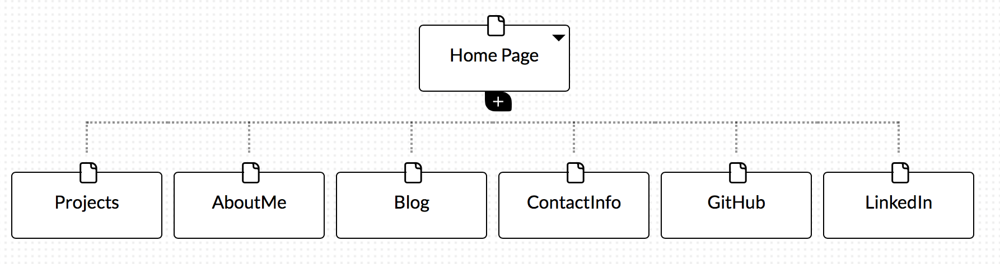

#Design Reflection

##What are the six Phases of Web Design?
The six phases of Web Design are:Information gathering, planning, design, development, testing and delivery, and maintenance.
##What is your site's primary goal or purpose? What kind of content will your site feature?
The primary goal of my site is to introduce myself, give the visitors a good idea of my journey up to this point wheen I joined DBC. I also want to share the progress as move along this web developper journey, I will do this by maintaining a blog and sharing projects I work on.
##What is your target audience's interests and how do you see your site addressing them?
My target audience will be primarily professional. I will target potential employers by enabling them to browse through current and past projects. I will also use links to professional networking sites like LinkedIn.
##What is the primary "action" the user should take when coming to your site? Do you want them to search for information, contact you, or see your portfolio? It's ok to have several actions at once, or different actions for different kinds of visitors.
The primary action would be for prossionals or future employers to navigate to my portfolio in a clean manner and be able to see from the projects i've done and contributed to what are my strengths and interests. From there I look for them to see a common interest and contact me.
##What are the main things someone should know about design and user experience?
User experience is about understanding how users feel when interacting with the sofware. It takes into account, its utility, the ease with performing tasks, what is the value added. Before User Experience, design was centered mostly around the one making it without much thought as to how it will be perceived by the the user. Nowadays, websites being so complex and feature rich, a science of how User will "enjoy" interacting with the website has come forefront and this is where User Experience design comes in.
##What is user experience design and why is it valuable?
From a statistical point of view a good User Experience can improve page views, bounce rates and conversion rates of a website. Although this can't be proven, it can be assumed. When a site is very complex, User Experience will provide great value by getting all those tasks/features to be performed in an efficient, clear and friendly way. Finally, User Experience provides an overall evalutation of the system via : A/B testing, User surveys, Wireframes&prototypes, User flow, storytelling and design patters.

##Which parts of the challenge did you find tedious?
The hardest part of this challenges was getting my image to show appropriately in the MD file. I got confused over relative and absolute referencing.
