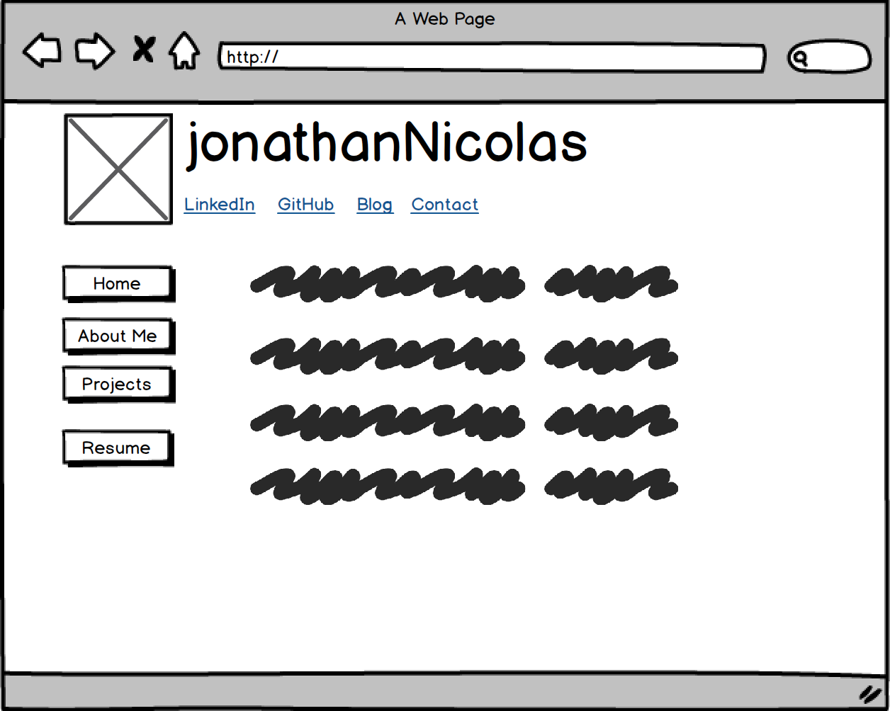
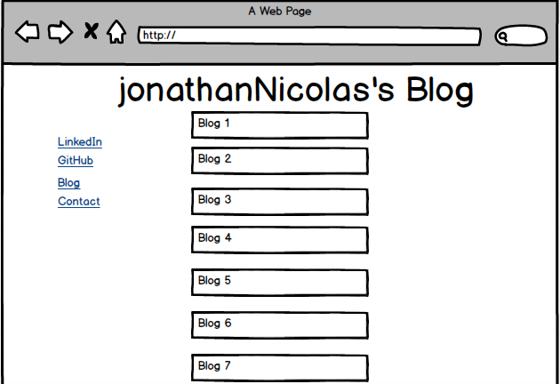

#Index Wireframe

#Blog Wireframe

##What is a wireframe?
Wireframe is a visual guide of how the website will look like. It is a step of the screen design process which enables you to arrange your your boxes of information depending on how you want the user to process them.
A wireframe may contain the following but varies in complexity :
-Structure of a page
-Layout content
-Functionality available
-calls to action
-User interface

##What are the benefits of wireframing?
Wireframing is good to quickly get down ideas on paper or wireframe software and get feedback before even getting into coding. This will save a lot of time. It is also a good tool to communicates specifications to a client. From the desginer's perspective it allows him to plan the layout and interaction of an interface without getting bogged down by details. If the system isn't clear on a wireframe there is low probablity for it to be clear afterwards.

##Did you enjoy wireframing your site?
Balsamiq was very user friendly.
##Did you revise your wireframe or stick with your first idea?
I revised it after reading somewhere about the "F" rule for UX. Meaning that the top left will tend to have more importance for users. So I decided to try to incorporate that.
##What questions did you ask during this challenge? What resources did you find to help you answer them?
The question I asked myself during this assignment is how is a website layed out. If I am not mistaken it looks like all websites can be decomposed into boxes which was a very interesting insight into web designing.
##Which parts of the challenge did you enjoy and which parts did you find tedious?
I enjoyed playing with Balsamiq. Again the issue of linking the picture of balsamiq to my Markdown file was causing me issues cause Balsamiq wasn't saving it into the format I wanted.
