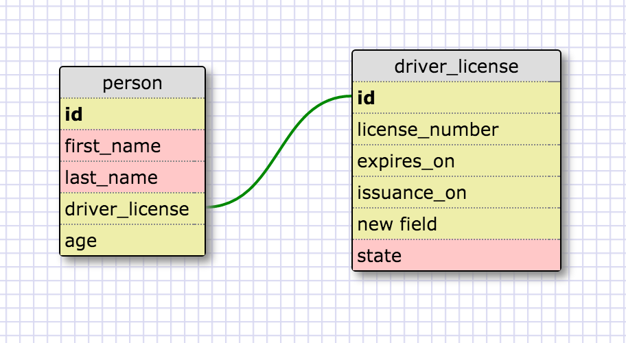
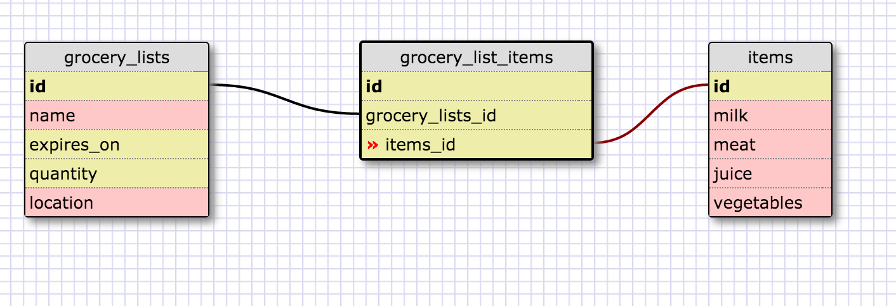

#Reflection
What is a one-to-one database?
In a one-to-one database, each row in one database table is linked to 1 and only 1 other row in another table.

When would you use a one-to-one database? (Think generally, not in terms of the example you created).
If data in one table is related to, but does not 'belong' to the entity described by the other, then that's a candidate to use one-to-one. This also help in management of memory are they data is not duplicated.

What is a many-to-many database?
A many-to-many relationship refers to a relationship between tables in a database when a parent row in one table contains several child rows in the second table.

When would you use a many-to-many database? (Think generally, not in terms of the example you created).
The many-to-many database is used when the rows in the first table can map to multiple rows in the second table

What is confusing about database schemas? What makes sense?
Choosing the bestfit schema for the data being analysed