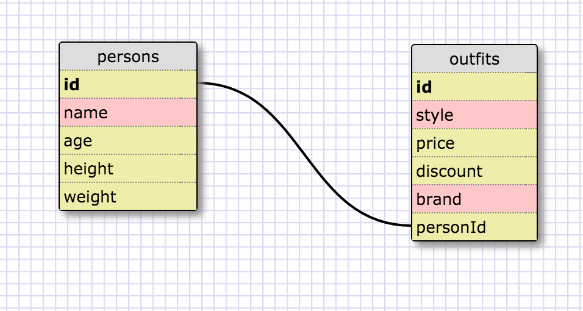

# Introduction to Database Schemas and SQL
1. SELECT*FROM states;
2. SELECT*FROM regions;
3. SELECT state_name, population FROM states;
4. SELECT state_name, population FROM states ORDER BY population DESC;
5. SELECT state_name FROM states WHERE region_id = 7;
6. SELECT state_name, population_density FROM states WHERE population_density > 50 ORDER BY population_density ASC;
7. SELECT state_name FROM states WHERE population BETWEEN 1000000 AND 1500000;
8. SELECT state_name, region_id FROM states ORDER BY region_id ASC;
9. SELECT region_name FROM regions WHERE region_name LIKE "%Central";
10.SELECT region_name, state_name FROM regions INNER JOIN states ON regions.id=states.region_id ORDER BY states.region_id ASC;

#Reflection

##What are databases for?
There are a myriad of uses for databases. For example by using a database on a commercial web site like an online store, you could store visitor information for logging in, purchase information, order logs, bookkeeping information, company reports, pricing structures, account information and the list goes on. Large amounts of data can be stored for future usage and easy accessability.
##What is a one-to-many relationship?
In a one-to-many relationship between object A and Object B, each element in object A is linked to 0, 1 or many elements in object B.
##What is a primary key? What is a foreign key? How can you determine which is which?
A primary key, also called a primary keyword, is a key in a relational database that is unique for each record.
##How can you select information out of a SQL database? What are some general guidelines for that?
Using SQL query commands. SELECT folowed by a condition statement that will narrow down the information retreived.